# LMS Workflow Diagram

Below is the updated workflow diagram for the Lab Management System, aligned with the new role standardization and process requirements.

```mermaid
graph TD
    %% Node Styles
    classDef start_end fill:#e1f5fe,stroke:#01579b,stroke-width:2px,rx:10,ry:10;
    classDef process fill:#e3f2fd,stroke:#1565c0,stroke-width:2px;
    classDef decision fill:#fff3e0,stroke:#ef6c00,stroke-width:2px;
    classDef approval fill:#e8f5e9,stroke:#2e7d32,stroke-width:2px;

    Start((Start)):::start_end
    CustomerRequest[Customer Request]:::process
    SalesForward[Sales Manager forwards request]:::process
    TechCheck[Technical Feasibility Check - Team Lead]:::process
    Feasible{Feasible?}:::decision
    InformCustomer[Sales Manager informs Customer]:::process
    PMReview[Project Manager reviews feasibility]:::process
    QuotePrep[Quotation Preparation - Finance Manager]:::process
    QuoteReview[Quotation Review - Project Manager]:::process
    QuoteApproval[Quotation Approval - Sales Manager]:::approval
    SendQuote[Quotation sent to Customer - Sales Manager]:::process
    CustomerApprove{Customer Approves?}:::decision
    Negotiation[SM + PM review, Finance Manager handles negotiation]:::process
    AssignTesting[Project Manager assigns testing to Team Lead]:::process
    PerformTesting[Team Lead performs / coordinates testing]:::process
    CompileResults[Test results compiled - Team Lead]:::process
    ReviewReport[Report reviewed - Team Lead]:::process
    FinalApproval[Final Report Approval - Quality Manager + Project Manager]:::approval
    CustComm[Sales Manager handles customer communication]:::process
    PaymentDone{Payment Completed? - Finance Manager}:::decision
    HoldReport[Sales Manager holds report until payment]:::process
    SendReport[Sales Manager sends report to customer]:::process
    End((Process Completed)):::start_end

    %% Flow
    Start --> CustomerRequest
    CustomerRequest --> SalesForward
    SalesForward --> TechCheck
    TechCheck --> Feasible
    
    Feasible -- NO --> InformCustomer
    Feasible -- YES --> PMReview
    
    PMReview --> QuotePrep
    QuotePrep --> QuoteReview
    QuoteReview --> QuoteApproval
    QuoteApproval --> SendQuote
    SendQuote --> CustomerApprove
    
    CustomerApprove -- NO --> Negotiation
    Negotiation --> SendQuote
    
    CustomerApprove -- YES --> AssignTesting
    AssignTesting --> PerformTesting
    PerformTesting --> CompileResults
    CompileResults --> ReviewReport
    ReviewReport --> FinalApproval
    FinalApproval --> CustComm
    CustComm --> PaymentDone
    
    PaymentDone -- NO --> HoldReport
    HoldReport --> PaymentDone
    
    PaymentDone -- YES --> SendReport
    SendReport --> End
```

### Role Summary
- **Sales Manager**: Handles customer communication, quotation approval, and sending the final report.
- **Project Manager**: Project coordination, feasibility review, quotation review, and final report approval.
- **Finance Manager**: Quotation preparation, negotiation, and payment verification.
- **Team Lead**: Technical feasibility checks, coordinating/performing testing, and report reviews.
- **Quality Manager**: Final report approval.
- **Sales Engineer**: Initial intake and support (as defined in the RBAC matrix).

### Visual Style Reference
- **Start/End**: Rounded nodes (Green-ish/Light Blue used for clarity in Mermaid)
- **Process**: Blue rectangles
- **Decision**: Orange diamonds
- **Approval**: Light green rectangles
